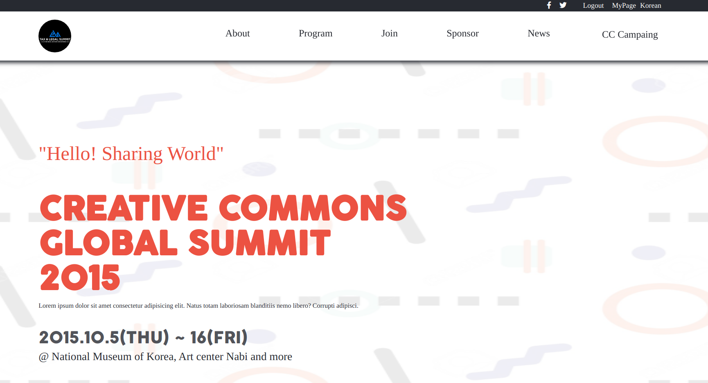
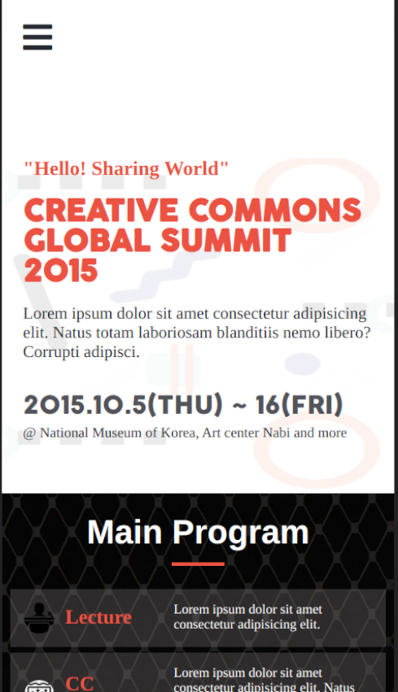

# conference-website
> Online website for conference. An easy way to hold a conference online.

This is a capstone project on online conferencing to showcase the skills I acquired in the first 4 weeks of the Microverse program started on July 5, 2021.

## Built With

- HTML
- CSS
- JavaScript

## Live Demo
[See Website Here](https://henrykc24.github.io/conference-website/)

## Getting Started

To get a local copy up and running follow these simple example steps.

Clone the repo with `git clone https://henrykc24.github.io/conference-website.git`

Run `npm install` from the command line

Run `npx hint .` to test for html linting check

Run `npx stylelint "**/*.{css,scss}"` to test for css linting check 

Run `npx eslint .` to test for js linting check

The app is deployed using GitHub pages.

## Author

👤 **Henry Kc**

- GitHub: [@githubhandle](https://github.com/henrykc24)
- Twitter: [@twitterhandle](https://twitter.com/henrykc24)
- LinkedIn: [LinkedIn](https://linkedin.com/in/henry-kc)

## 🤝 Contributing

Contributions, issues, and feature requests are welcome!

Feel free to check the [issues page](https://henrykc24.github.io/conference-website/issues/).

## Show your support

Give a ⭐️ if you like this project!

## Acknowledgments

- A spcial thanks to  "Creative Commons license of the design" for providing me with the design template used for this project.
- A special thanks to Microverse for inspiring this project. I am indebted to you all at Microverse
- A special thanks goes to all my peers at Microverse for being ther for me. I received had series of standup meetings during which ideas was shared about how best to approach this project.

## 📝 License

This project is [MIT](./LICENSE) licensed.
